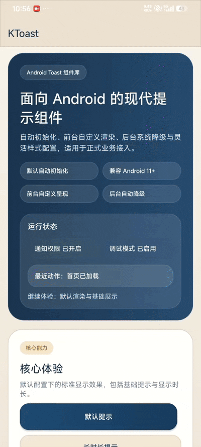
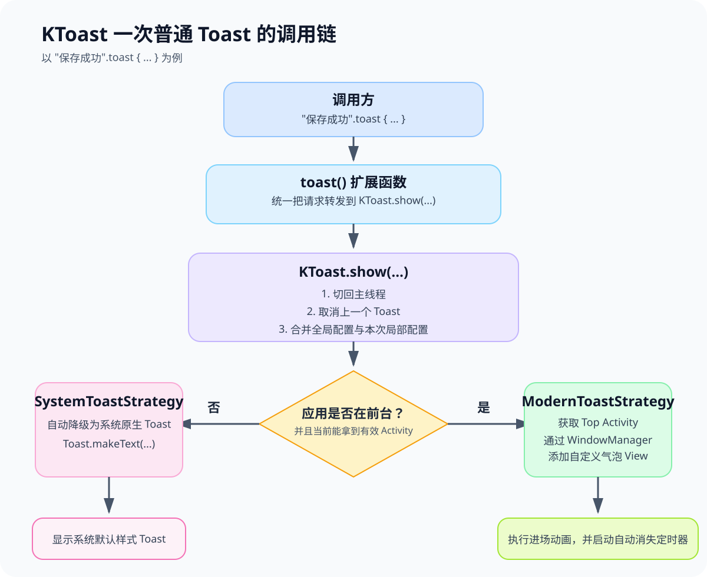

# 🍞 KToast

[](https://opensource.org/licenses/MIT)


English document [README_EN.md](./README_EN.md)

KToast 是一个面向 Android 的现代 Toast 组件库，提供自动初始化、前台自定义渲染、后台系统降级与灵活样式配置能力，适合直接接入正式业务场景。

下面给出依赖、默认行为和常用接入方式。

## 30 秒接入

### 1. 添加仓库

`settings.gradle.kts` 或根 `build.gradle.kts`：

```kotlin
dependencyResolutionManagement {
    repositories {
        mavenCentral()
    }
}
```

### 2. 添加依赖

模块 `build.gradle.kts`：
[](https://central.sonatype.com/artifact/io.github.logan0817/ktoast)

```kotlin
dependencies {
    implementation("io.github.logan0817:ktoast:1.0.5") // 替换为上方徽章显示的最新版本
}
```

Groovy 写法：

```gradle
dependencies {
    implementation 'io.github.logan0817:ktoast:1.0.5' // 替换为上方徽章显示的最新版本
}
```

### 3. 直接调用

```kotlin
import com.logan.ktoast.toast

"保存成功".toast()
```

> 默认不需要手动初始化。只要你没有关闭 Jetpack App Startup，KToast 会自动完成初始化。

## 默认行为

第一次上手时，最容易关心的是这 4 件事：

1. 初始化：默认自动初始化。只有你主动关闭 App Startup 时，才需要手动 `KToast.init(app)`。
2. 显示策略：默认是 `REPLACE`，新 Toast 会替换旧 Toast。
3. 前后台差异：前台优先走自定义气泡，后台或拿不到可用 `Activity` 时会自动降级为系统 Toast。
4. 线程：普通 `toast()` 调用会自动切回主线程执行。

## 快速开始

### 最小可用示例

```kotlin
import com.logan.ktoast.toast

fun showSavedToast() {
    "保存成功".toast()
}
```

### 全局样式

```kotlin
import android.app.Application
import android.graphics.Color
import android.view.Gravity
import com.logan.ktoast.KToast

class MyApplication : Application() {
    override fun onCreate() {
        super.onCreate()
        KToast.setDebugMode(BuildConfig.DEBUG).config {
            textColor = Color.WHITE
            backgroundColor = Color.parseColor("#E6323232")
            backgroundRadius = 24f
            gravity = Gravity.CENTER
            yOffset = 0
            textSize = 14f
        }
    }
}
```

### 单次样式覆盖

```kotlin
import android.graphics.Color
import com.logan.ktoast.toast

"上传成功".toast {
    backgroundColor = Color.parseColor("#2E7D32")
    textColor = Color.WHITE
    icon = android.R.drawable.ic_dialog_info
    backgroundRadius = 50f
}
```

### Java 调用

```java
import android.graphics.Color;
import android.widget.Toast;
import com.logan.ktoast.KToast;
import kotlin.Unit;

KToast.setDebugMode(BuildConfig.DEBUG);

KToast.config(config -> {
    config.setBackgroundColor(Color.RED);
    return Unit.INSTANCE;
});

KToast.show("Hello from Java", Toast.LENGTH_SHORT);
KToast.showDebug("Debug only");
Runnable task = KToast.showDelayed("Show after 2 seconds", 2000L);
KToast.cancelDelayed(task);
```

## 常见场景

### 1. 延时显示与撤回

```kotlin
import com.logan.ktoast.KToast
import com.logan.ktoast.toastDelayed

val task = "2 秒后显示".toastDelayed(2000L)
KToast.cancelDelayed(task)
```

### 2. 点击立即关闭

```kotlin
import com.logan.ktoast.toast

"点击我可立即关闭".toast {
    cancelOnTouch = true
    animationDuration = 500L
}
```

### 3. 队列展示

```kotlin
import com.logan.ktoast.toastHandle
import com.logan.ktoast.runtime.KToastDisplayMode

listOf("上传 1", "上传 2", "上传 3").forEach { message ->
    message.toastHandle(
        behavior = {
            displayMode = KToastDisplayMode.QUEUE
            groupKey = "upload"
        }
    )
}
```

### 4. 按组取消

```kotlin
import com.logan.ktoast.KToast

KToast.cancelGroup("upload")
```

### 5. 窗口内忽略重复消息

```kotlin
import com.logan.ktoast.toastHandle
import com.logan.ktoast.runtime.KToastDisplayMode

"保存成功".toastHandle(
    behavior = {
        displayMode = KToastDisplayMode.IGNORE_IF_SAME
        windowMillis = 1500L
    }
)
```

### 6. 自定义内容 View

纯代码构建 View：

```kotlin
import android.widget.TextView
import com.logan.ktoast.toastHandle
import com.logan.ktoast.runtime.KToastContentFactory

"自定义布局".toastHandle {
    contentFactory = KToastContentFactory { context, message, config ->
        TextView(context).apply {
            text = ">>> $message"
            setTextColor(config.textColor)
            setPadding(32, 20, 32, 20)
        }
    }
}
```

引用 XML 布局：

`res/drawable/bg_toast_custom.xml`

```xml
<?xml version="1.0" encoding="utf-8"?>
<shape xmlns:android="http://schemas.android.com/apk/res/android">
    <solid android:color="#E6323232" />
    <corners android:radius="20dp" />
</shape>
```

`res/layout/view_toast_custom.xml`

```xml
<?xml version="1.0" encoding="utf-8"?>
<LinearLayout xmlns:android="http://schemas.android.com/apk/res/android"
    android:layout_width="wrap_content"
    android:layout_height="wrap_content"
    android:background="@drawable/bg_toast_custom"
    android:orientation="vertical"
    android:padding="16dp">

    <TextView
        android:id="@+id/tvToastTitle"
        android:layout_width="wrap_content"
        android:layout_height="wrap_content"
        android:text="上传状态"
        android:textStyle="bold" />

    <TextView
        android:id="@+id/tvToastMessage"
        android:layout_width="wrap_content"
        android:layout_height="wrap_content"
        android:layout_marginTop="6dp" />
</LinearLayout>
```

```kotlin
import android.content.res.ColorStateList
import android.view.LayoutInflater
import android.widget.TextView
import com.logan.ktoast.toastHandle
import com.logan.ktoast.runtime.KToastContentFactory

"上传成功".toastHandle {
    contentFactory = KToastContentFactory { context, message, config ->
        LayoutInflater.from(context)
            .inflate(R.layout.view_toast_custom, null, false)
            .apply {
                backgroundTintList = ColorStateList.valueOf(config.backgroundColor)
                findViewById<TextView>(R.id.tvToastTitle).text = "上传状态"
                findViewById<TextView>(R.id.tvToastMessage).apply {
                    text = message
                    textSize = config.textSize
                    setTextColor(config.textColor)
                }
            }
    }
}
```

### 7. App 层二次封装

建议把业务语义放在你自己的 App 层，而不是直接写在每个页面里。

可参考 [AppToastExt.kt](./app/src/main/java/com/logan/ktoastapp/AppToastExt.kt)：

```kotlin
import android.graphics.Color
import com.logan.ktoast.config.KToastConfig
import com.logan.ktoast.toast

fun CharSequence?.toastSuccess(block: (KToastConfig.() -> Unit)? = null) {
    this.toast {
        backgroundColor = Color.parseColor("#4CAF50")
        icon = android.R.drawable.ic_dialog_info
        iconColor = Color.WHITE
        block?.invoke(this)
    }
}

fun CharSequence?.toastError(block: (KToastConfig.() -> Unit)? = null) {
    this.toast {
        backgroundColor = Color.parseColor("#F44336")
        icon = android.R.drawable.ic_delete
        iconColor = Color.WHITE
        block?.invoke(this)
    }
}

fun CharSequence?.toastWarning(block: (KToastConfig.() -> Unit)? = null) {
    this.toast {
        backgroundColor = Color.parseColor("#FF9800")
        icon = android.R.drawable.ic_dialog_alert
        iconColor = Color.WHITE
        block?.invoke(this)
    }
}
```

这里为了保证示例开箱即编译，图标用了系统内置 drawable；真实项目里替换成你自己的资源即可。

## 常用配置

第一次接入通常只会改这些高频项：

| 配置项 | 类型 | 默认值 | 说明 |
| :--- | :--- | :--- | :--- |
| `textColor` | Int | `White` | 文本颜色 |
| `backgroundColor` | Int | `#E6323232` | 背景色 |
| `backgroundRadius` | Float | `24f` | 圆角 |
| `gravity` | Int | `BOTTOM + CENTER_HORIZONTAL` | 显示位置 |
| `yOffset` | Int | `64` | 纵向偏移 |
| `animationDuration` | Long | `250` | 动画时长 |
| `cancelOnTouch` | Boolean | `false` | 是否点击关闭 |
| `icon` | Int? | `null` | 图标资源 |
| `maxLines` | Int | `4` | 最大行数 |
| `contentFactory` | `KToastContentFactory?` | `null` | 自定义内容工厂 |

完整配置可查看 [KToastConfig.kt](./library-android/src/main/java/com/logan/ktoast/config/KToastConfig.kt)。

## FAQ

### 1. 为什么我没有手动 `init()` 也能用？

因为默认集成了 Jetpack App Startup。只有你主动关闭它，才需要自己调用：

```kotlin
KToast.init(application)
```

### 2. 为什么前台是自定义样式，后台变成系统 Toast？

这是 KToast 的保底策略。前台会优先走自定义渲染，后台或无可用 `Activity` 时自动降级为系统 Toast，避免直接失败。

### 3. Android 11+ 为什么还需要这套实现？

因为 Android 11+ 对自定义 Toast 做了限制，直接 `Toast.setView()` 不再可靠。KToast 前台使用 `WindowManager` 渲染来保持体验一致。

### 4. 后台测试为什么有时看不到？

后台系统 Toast 仍然受通知权限和 ROM 策略影响。可在 Demo 页面查看权限状态后体验后台场景。

### 5. 混淆要额外配置吗？

通常不用。库里已经包含 `consumer-rules.pro`。

## Demo 与源码入口

1. 示例工程在 [`app`](./app) 模块。
2. [MainActivity.kt](./app/src/main/java/com/logan/ktoastapp/MainActivity.kt) 展示了当前 Demo 页的完整能力入口。
3. 业务封装示例在 [AppToastExt.kt](./app/src/main/java/com/logan/ktoastapp/AppToastExt.kt)。
4. 你也可以直接下载 [Demo APK](https://raw.githubusercontent.com/logan0817/KToast/master/app/apk/app-debug.apk) 体验。
5. 效果展示 
## 进阶能力

### 1. 生命周期回调

```kotlin
import com.logan.ktoast.runtime.KToastCallbacks

"提交中".toastHandle(
    callbacks = KToastCallbacks(
        onShow = { println("shown: ${it.id}") },
        onDismiss = { _, reason -> println("dismissed: $reason") }
    )
)
```

### 2. 调试模式

```kotlin
import com.logan.ktoast.debugShow

"只在 Debug 模式显示".debugShow()
```

### 3. 调用链

调用链如下：



## 版本兼容与实现说明

1. 平台：Android 5.0+。2. 前台自定义渲染，后台自动降级。3. Kotlin 为主，也支持 Java 静态调用。4. 当前仓库同时包含库模块和 Demo 模块，适合直接本地验证。

## License

```text
MIT License

Copyright (c) 2026 Logan Gan

Permission is hereby granted, free of charge, to any person obtaining a copy
of this software and associated documentation files (the "Software"), to deal
in the Software without restriction, including without limitation the rights
to use, copy, modify, merge, publish, distribute, sublicense, and/or sell
copies of the Software, and to permit persons to whom the Software is
furnished to do so, subject to the following conditions:

The above copyright notice and this permission notice shall be included in all
copies or substantial portions of the Software.

THE SOFTWARE IS PROVIDED "AS IS", WITHOUT WARRANTY OF ANY KIND, EXPRESS OR
IMPLIED, INCLUDING BUT NOT LIMITED TO THE WARRANTIES OF MERCHANTABILITY,
FITNESS FOR A PARTICULAR PURPOSE AND NONINFRINGEMENT. IN NO EVENT SHALL THE
AUTHORS OR COPYRIGHT HOLDERS BE LIABLE FOR ANY CLAIM, DAMAGES OR OTHER
LIABILITY, WHETHER IN AN ACTION OF CONTRACT, TORT OR OTHERWISE, ARISING FROM,
OUT OF OR IN CONNECTION WITH THE SOFTWARE OR THE USE OR OTHER DEALINGS IN THE
SOFTWARE.
```
