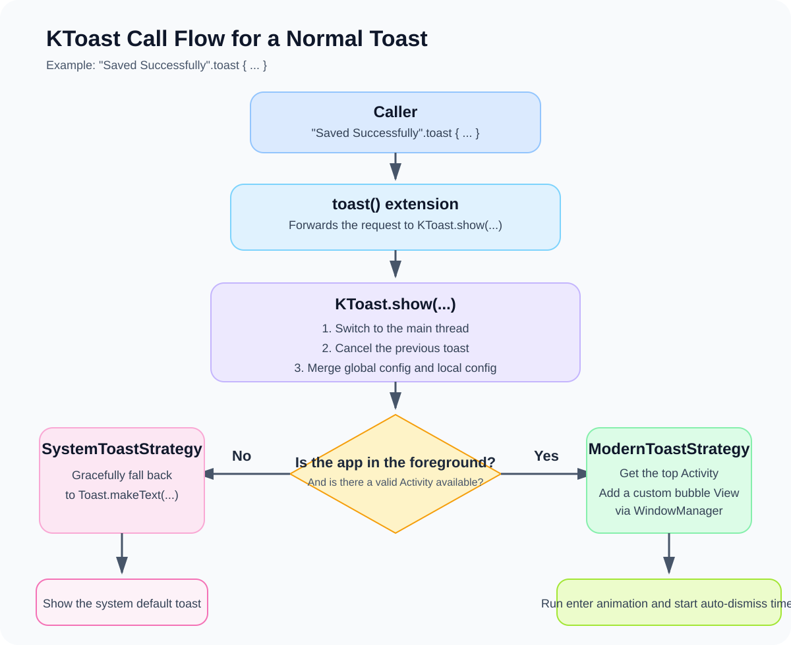

# 🍞 KToast

[](https://opensource.org/licenses/MIT)


中文文档 [README.md](./README.md)

KToast is a modern Android Toast library with automatic initialization, custom foreground rendering, background system fallback, and flexible style configuration for production apps.

The sections below cover dependency setup, default behavior, and common integration paths.

## 30-Second Setup

### 1. Add repositories

`settings.gradle.kts` or root `build.gradle.kts`:

```kotlin
dependencyResolutionManagement {
    repositories {
        mavenCentral()
    }
}
```

### 2. Add dependency
[](https://central.sonatype.com/artifact/io.github.logan0817/ktoast)

Module `build.gradle.kts`:

```kotlin
dependencies {
    implementation("io.github.logan0817:ktoast:1.0.5") // Replace with the latest version shown by the badge above
}
```

Groovy:

```gradle
dependencies {
    implementation 'io.github.logan0817:ktoast:1.0.5' // Replace with the latest version shown by the badge above
}
```

### 3. Show your first Toast

```kotlin
import com.logan.ktoast.toast

"Saved".toast()
```

> Manual initialization is not required by default. KToast auto-initializes through Jetpack App Startup unless you explicitly disable it.

## Default Behavior

These are the 4 default rules most users care about first:

1. Initialization: automatic by default. Only call `KToast.init(app)` if you disable App Startup.
2. Display policy: default mode is `REPLACE`.
3. Foreground vs background: foreground prefers custom UI, background falls back to system Toast.
4. Threading: normal `toast()` calls are marshalled to the main thread automatically.

## Quick Start

### Minimal usage

```kotlin
import com.logan.ktoast.toast

fun showSavedToast() {
    "Saved".toast()
}
```

### Global style

```kotlin
import android.app.Application
import android.graphics.Color
import android.view.Gravity
import com.logan.ktoast.KToast

class MyApplication : Application() {
    override fun onCreate() {
        super.onCreate()
        KToast.setDebugMode(BuildConfig.DEBUG).config {
            textColor = Color.WHITE
            backgroundColor = Color.parseColor("#E6323232")
            backgroundRadius = 24f
            gravity = Gravity.CENTER
            yOffset = 0
            textSize = 14f
        }
    }
}
```

### Per-call style override

```kotlin
import android.graphics.Color
import com.logan.ktoast.toast

"Uploaded".toast {
    backgroundColor = Color.parseColor("#2E7D32")
    textColor = Color.WHITE
    icon = android.R.drawable.ic_dialog_info
    backgroundRadius = 50f
}
```

### Java usage

```java
import android.graphics.Color;
import android.widget.Toast;
import com.logan.ktoast.KToast;
import kotlin.Unit;

KToast.setDebugMode(BuildConfig.DEBUG);

KToast.config(config -> {
    config.setBackgroundColor(Color.RED);
    return Unit.INSTANCE;
});

KToast.show("Hello from Java", Toast.LENGTH_SHORT);
KToast.showDebug("Debug only");
Runnable task = KToast.showDelayed("Show after 2 seconds", 2000L);
KToast.cancelDelayed(task);
```

## Common Scenarios

### 1. Delayed show and revoke

```kotlin
import com.logan.ktoast.KToast
import com.logan.ktoast.toastDelayed

val task = "Show after 2 seconds".toastDelayed(2000L)
KToast.cancelDelayed(task)
```

### 2. Tap to dismiss

```kotlin
import com.logan.ktoast.toast

"Tap me to dismiss".toast {
    cancelOnTouch = true
    animationDuration = 500L
}
```

### 3. Queue mode

```kotlin
import com.logan.ktoast.toastHandle
import com.logan.ktoast.runtime.KToastDisplayMode

listOf("Upload 1", "Upload 2", "Upload 3").forEach { message ->
    message.toastHandle(
        behavior = {
            displayMode = KToastDisplayMode.QUEUE
            groupKey = "upload"
        }
    )
}
```

### 4. Cancel by group

```kotlin
import com.logan.ktoast.KToast

KToast.cancelGroup("upload")
```

### 5. Ignore duplicate messages within a window

```kotlin
import com.logan.ktoast.toastHandle
import com.logan.ktoast.runtime.KToastDisplayMode

"Saved".toastHandle(
    behavior = {
        displayMode = KToastDisplayMode.IGNORE_IF_SAME
        windowMillis = 1500L
    }
)
```

### 6. Custom content View

Build the view directly in code:

```kotlin
import android.widget.TextView
import com.logan.ktoast.toastHandle
import com.logan.ktoast.runtime.KToastContentFactory

"Custom layout".toastHandle {
    contentFactory = KToastContentFactory { context, message, config ->
        TextView(context).apply {
            text = ">>> $message"
            setTextColor(config.textColor)
            setPadding(32, 20, 32, 20)
        }
    }
}
```

Reference an XML layout:

`res/drawable/bg_toast_custom.xml`

```xml
<?xml version="1.0" encoding="utf-8"?>
<shape xmlns:android="http://schemas.android.com/apk/res/android">
    <solid android:color="#E6323232" />
    <corners android:radius="20dp" />
</shape>
```

`res/layout/view_toast_custom.xml`

```xml
<?xml version="1.0" encoding="utf-8"?>
<LinearLayout xmlns:android="http://schemas.android.com/apk/res/android"
    android:layout_width="wrap_content"
    android:layout_height="wrap_content"
    android:background="@drawable/bg_toast_custom"
    android:orientation="vertical"
    android:padding="16dp">

    <TextView
        android:id="@+id/tvToastTitle"
        android:layout_width="wrap_content"
        android:layout_height="wrap_content"
        android:text="Upload status"
        android:textStyle="bold" />

    <TextView
        android:id="@+id/tvToastMessage"
        android:layout_width="wrap_content"
        android:layout_height="wrap_content"
        android:layout_marginTop="6dp" />
</LinearLayout>
```

```kotlin
import android.content.res.ColorStateList
import android.view.LayoutInflater
import android.widget.TextView
import com.logan.ktoast.toastHandle
import com.logan.ktoast.runtime.KToastContentFactory

"Uploaded".toastHandle {
    contentFactory = KToastContentFactory { context, message, config ->
        LayoutInflater.from(context)
            .inflate(R.layout.view_toast_custom, null, false)
            .apply {
                backgroundTintList = ColorStateList.valueOf(config.backgroundColor)
                findViewById<TextView>(R.id.tvToastTitle).text = "Upload status"
                findViewById<TextView>(R.id.tvToastMessage).apply {
                    text = message
                    textSize = config.textSize
                    setTextColor(config.textColor)
                }
            }
    }
}
```

### 7. App-level wrapper

You should keep business semantics inside your app layer instead of hard-coding them into every screen.

See [AppToastExt.kt](./app/src/main/java/com/logan/ktoastapp/AppToastExt.kt):

```kotlin
import android.graphics.Color
import com.logan.ktoast.config.KToastConfig
import com.logan.ktoast.toast

fun CharSequence?.toastSuccess(block: (KToastConfig.() -> Unit)? = null) {
    this.toast {
        backgroundColor = Color.parseColor("#4CAF50")
        icon = android.R.drawable.ic_dialog_info
        iconColor = Color.WHITE
        block?.invoke(this)
    }
}

fun CharSequence?.toastError(block: (KToastConfig.() -> Unit)? = null) {
    this.toast {
        backgroundColor = Color.parseColor("#F44336")
        icon = android.R.drawable.ic_delete
        iconColor = Color.WHITE
        block?.invoke(this)
    }
}

fun CharSequence?.toastWarning(block: (KToastConfig.() -> Unit)? = null) {
    this.toast {
        backgroundColor = Color.parseColor("#FF9800")
        icon = android.R.drawable.ic_dialog_alert
        iconColor = Color.WHITE
        block?.invoke(this)
    }
}
```

The example uses built-in Android drawables so it compiles out of the box. Replace them with your own brand assets in a real app.

## Common Configs

These are the high-frequency options most users tweak first:

| Option | Type | Default | Description |
| :--- | :--- | :--- | :--- |
| `textColor` | Int | `White` | Text color |
| `backgroundColor` | Int | `#E6323232` | Background color |
| `backgroundRadius` | Float | `24f` | Corner radius |
| `gravity` | Int | `BOTTOM + CENTER_HORIZONTAL` | Position |
| `yOffset` | Int | `64` | Vertical offset |
| `animationDuration` | Long | `250` | Animation duration |
| `cancelOnTouch` | Boolean | `false` | Dismiss on tap |
| `icon` | Int? | `null` | Icon resource |
| `maxLines` | Int | `4` | Max text lines |
| `contentFactory` | `KToastContentFactory?` | `null` | Custom content factory |

For the full set, see [KToastConfig.kt](./library-android/src/main/java/com/logan/ktoast/config/KToastConfig.kt).

## FAQ

### 1. Why does it work without calling `init()`?

Because App Startup is enabled by default. Only call this manually if you disable it:

```kotlin
KToast.init(application)
```

### 2. Why is foreground custom but background system-native?

That is the built-in fallback policy. Foreground uses the custom bubble path. Background or no valid `Activity` falls back to system Toast.

### 3. Why is this needed on Android 11+?

Because Android 11+ limits traditional custom Toast approaches. KToast uses a `WindowManager` path in the foreground to keep the experience stable.

### 4. Why does the background demo sometimes not show?

Background system Toasts are still affected by notification permission and OEM ROM policy. You can review permission state directly in the Demo page before trying the background path.

### 5. Do I need extra ProGuard rules?

Usually no. The library already ships with `consumer-rules.pro`.

## Demo and Source Entry Points

1. The sample app lives in the [`app`](./app) module. 2. [MainActivity.kt](./app/src/main/java/com/logan/ktoastapp/MainActivity.kt) contains the current Demo page and its capability entry points. 3. App-level wrapper examples live in [AppToastExt.kt](./app/src/main/java/com/logan/ktoastapp/AppToastExt.kt). 4. You can also download the [Demo APK](https://raw.githubusercontent.com/logan0817/KToast/master/app/apk/app-debug.apk).

## Advanced Capabilities

### 1. Lifecycle callbacks

```kotlin
import com.logan.ktoast.runtime.KToastCallbacks

"Submitting".toastHandle(
    callbacks = KToastCallbacks(
        onShow = { println("shown: ${it.id}") },
        onDismiss = { _, reason -> println("dismissed: $reason") }
    )
)
```

### 2. Debug-only toasts

```kotlin
import com.logan.ktoast.debugShow

"Shown only in debug mode".debugShow()
```

### 3. Internal call flow

Call-flow overview:



## Compatibility Notes

1. Platform: Android 5.0+. 
2. Foreground prefers custom rendering, background falls back automatically. 
3. Kotlin first, Java compatible. 
4. This repo contains both the library module and the Demo app.
5. Effect Demonstration 

## License

```text
MIT License

Copyright (c) 2026 Logan Gan

Permission is hereby granted, free of charge, to any person obtaining a copy
of this software and associated documentation files (the "Software"), to deal
in the Software without restriction, including without limitation the rights
to use, copy, modify, merge, publish, distribute, sublicense, and/or sell
copies of the Software, and to permit persons to whom the Software is
furnished to do so, subject to the following conditions:

The above copyright notice and this permission notice shall be included in all
copies or substantial portions of the Software.

THE SOFTWARE IS PROVIDED "AS IS", WITHOUT WARRANTY OF ANY KIND, EXPRESS OR
IMPLIED, INCLUDING BUT NOT LIMITED TO THE WARRANTIES OF MERCHANTABILITY,
FITNESS FOR A PARTICULAR PURPOSE AND NONINFRINGEMENT. IN NO EVENT SHALL THE
AUTHORS OR COPYRIGHT HOLDERS BE LIABLE FOR ANY CLAIM, DAMAGES OR OTHER
LIABILITY, WHETHER IN AN ACTION OF CONTRACT, TORT OR OTHERWISE, ARISING FROM,
OUT OF OR IN CONNECTION WITH THE SOFTWARE OR THE USE OR OTHER DEALINGS IN THE
SOFTWARE.
```
